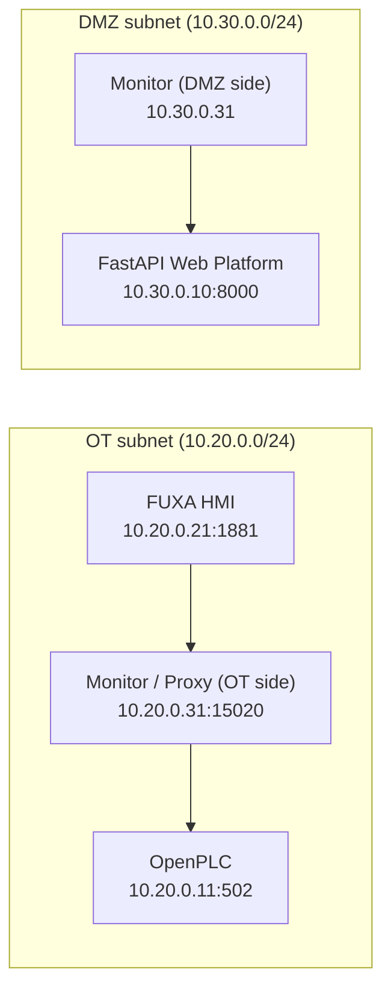

# OT Lab

OT Lab is a Docker-first OT/ICS simulation and monitoring framework for process-aware security experiments.

It combines a simulated industrial process, a PLC, an HMI, an inline Modbus/TCP monitoring path, passive packet inspection with `tshark`, and an initial semantic policy layer that interprets protocol-valid actions in process context.

The current public implementation is centered on Modbus/TCP and a tank-process demonstrator, but the architecture was shaped to support broader OT protocol coverage later without rebuilding the entire lab from scratch.

## What OT Lab Does Today

OT Lab currently provides:

- a reproducible Docker-based OT/DMZ lab topology;
- `OpenPLC` as the PLC runtime;
- `FUXA` as the HMI/SCADA front-end;
- a runtime container that works as:
  - inline Modbus/TCP proxy;
  - packet capture endpoint;
  - event forwarder to the backend;
- passive packet inspection through `tshark`;
- a FastAPI web application for:
  - topology/status visualization,
  - decoded OT event display,
  - operational action summarization,
  - semantic policy decisions,
  - simple test endpoints,
  - policy decision export;
- a reference tank process with:
  - fill pump,
  - outlet valve,
  - configurable flow setpoints,
  - high/low alarm setpoints,
  - live level telemetry.

The current research emphasis is not generic packet capture alone. It is the transition from:

- protocol event,

to:

- process-relevant action,

to:

- semantic judgement.

## Current Architecture

OT Lab is structured around two logical zones:

- an OT subnet, where the HMI, PLC, and OT-facing monitor interface exist;
- a DMZ subnet, where the web platform and DMZ-facing monitor interface exist.

The runtime container is dual-homed and bridges those concerns.



### High-Level Communication Model

There are two distinct paths in the lab:

1. **Data path**
   - HMI -> runtime proxy -> PLC
   - this is where Modbus/TCP traffic flows during normal operation

2. **Telemetry path**
   - runtime -> backend
   - this is where decoded OT events and monitor state are sent to the web platform

This separation is important because the monitor is not just a UI widget. It is a network-observing component with OT-side and DMZ-side responsibilities.

## Core Components

### 1. FastAPI backend

Main file:

- [app.py](app.py)

Responsibilities:

- serves the web UI;
- stores current session state;
- receives decoded OT events from the runtime;
- builds communication summaries;
- aggregates actions from raw packets;
- evaluates initial semantic policy rules;
- exposes helper APIs for read/write test operations;
- exports policy-decision evidence;
- coordinates monitor/proxy context such as:
  - HMI IP,
  - PLC IP,
  - monitor IP,
  - OT/DMZ subnets,
  - tag mappings.

### 2. Runtime monitor / proxy

Main file:

- [scripts/tshark_runtime.py](scripts/tshark_runtime.py)

Responsibilities:

- starts a Modbus/TCP inline proxy on port `15020`;
- forwards HMI traffic to the PLC upstream;
- runs `tshark` for packet inspection;
- extracts decoded protocol fields from live traffic;
- normalizes events before forwarding them to the backend.

Important implementation note:

- the proxy path is active only when the HMI points to `runtime:15020`;
- the packet capture is passive, using `tshark`;
- OT Lab does **not** currently implement a custom Modbus dissector from scratch.

### 3. OpenPLC

Role:

- simulated PLC runtime;
- executes the process logic written in Structured Text (`.st`);
- exposes Modbus/TCP to the HMI and to the test APIs through the runtime proxy.

The current example PLC logic is provided in:

- [openplc_tank_v1.st](scripts/v2_seed/openplc_tank_v1.st)

### 4. FUXA

Role:

- HMI/SCADA front-end;
- issues telemetry reads and operational writes over Modbus/TCP;
- allows view design and tag binding for process interaction.

The repo includes reusable FUXA project assets and recovered seeds under:

- [scripts/v2_seed](scripts/v2_seed)

### 5. tshark

Role:

- protocol-aware packet inspection engine;
- current source of decoded Modbus/TCP fields.

Why it is used:

- Wireshark/tshark already provide mature industrial protocol dissection;
- this lets OT Lab focus on process meaning, policy, and evidence generation;
- this makes future protocol expansion more practical than rebuilding dissectors manually.

## Repository Structure

Top-level layout:

```text
OT-Lab/
├── app.py
├── Dockerfile
├── docker-compose.yml
├── requirements.txt
├── agent/
│   └── protocols/
├── docker/
│   └── fuxa.Dockerfile
├── scripts/
│   ├── benchmark_modbus_latency.py
│   ├── tshark_runtime.py
│   ├── DOCKER_V2.md
│   └── v2_seed/
├── static/
│   ├── app.js
│   └── style.css
├── templates/
│   └── index.html
├── studies/
│   ├── chapter4_modbus_tcp_test_log.md
│   └── evidence/
└── v2_engine.py
```

### Files Required to Run the Lab

For ordinary public use, the important runtime files are:

- [docker-compose.yml](docker-compose.yml)
- [Dockerfile](Dockerfile)
- [docker/fuxa.Dockerfile](docker/fuxa.Dockerfile)
- [requirements.txt](requirements.txt)
- [app.py](app.py)
- [scripts/tshark_runtime.py](scripts/tshark_runtime.py)
- [static/app.js](static/app.js)
- [static/style.css](static/style.css)
- [templates/index.html](templates/index.html)
- [.env.example](.env.example)

### Files Useful for Initial Seeding

- [openplc_tank_v1.st](scripts/v2_seed/openplc_tank_v1.st)
- [fuxa_project_recovered_latest.json](scripts/v2_seed/fuxa_project_recovered_latest.json)
- [load_fuxa_seed.sh](scripts/v2_seed/load_fuxa_seed.sh)
- [backup_lab_state.sh](scripts/v2_seed/backup_lab_state.sh)

### Files Primarily for Research / Writing

- [studies/README.md](studies/README.md)
- [studies/chapter4_modbus_tcp_test_log.md](studies/chapter4_modbus_tcp_test_log.md)

## Networks, IPs, and Ports

The lab is parameterized via:

- [.env.example](.env.example)

### Default subnets

- OT subnet: `10.20.0.0/24`
- DMZ subnet: `10.30.0.0/24`

### Default service IPs

| Component | OT IP | DMZ IP |
| --- | --- | --- |
| Web platform | `10.20.0.10` | `10.30.0.10` |
| OpenPLC | `10.20.0.11` | not attached |
| FUXA HMI | `10.20.0.21` | not attached |
| Runtime monitor/proxy | `10.20.0.31` | `10.30.0.31` |

### Host-exposed ports

| Host port | Container target | Purpose |
| --- | --- | --- |
| `8000` | `web:8000` | OT Lab UI / API |
| `8081` | `openplc:8080` | OpenPLC web UI |
| `1502` | `openplc:502` | direct OpenPLC Modbus/TCP from host |
| `1881` | `hmi:1881` | FUXA web UI |
| `15020` | `runtime:15020` | monitored Modbus/TCP proxy |

### Internal ports that matter

| Port | Purpose |
| --- | --- |
| `502` | OpenPLC Modbus/TCP inside OT network |
| `15020` | runtime proxy listen port |
| `8000` | backend API |
| `1881` | FUXA server |
| `8080` | OpenPLC web UI inside container |

## Installation

### Prerequisites

Minimum recommended setup:

- Docker Desktop or Docker Engine with Compose support;
- Git;
- a modern browser;
- optional but useful:
  - `curl`
  - `python3`

Docker commands expected:

```bash
docker --version
docker compose version
```

### Clone the repository

```bash
git clone https://github.com/LiscereSecurity/OT-Lab.git
cd OT-Lab
```

### Create the environment file

```bash
cp .env.example .env
```

You can keep the defaults for a first run.

## Running the Lab

### Start everything

```bash
docker compose up -d --build
```

### Open the interfaces

- OT Lab web platform: [http://localhost:8000/?session_id=sess_v2_docker_local](http://localhost:8000/?session_id=sess_v2_docker_local)
- OpenPLC: [http://localhost:8081](http://localhost:8081)
- FUXA: [http://localhost:1881](http://localhost:1881)

### Stop the lab

```bash
docker compose down
```

### Stop and delete all persistent state

```bash
docker compose down -v
```

Use `-v` only if you intentionally want to reset OpenPLC and FUXA volumes.

## First-Time Setup

### 1. OpenPLC

Login defaults:

- username: `openplc`
- password: `openplc`

Upload and compile:

- [openplc_tank_v1.st](scripts/v2_seed/openplc_tank_v1.st)

Then start the PLC runtime from the OpenPLC web UI.

### 2. FUXA

You have two main options.

#### Option A: import a ready project

Use one of the included project exports, for example:

- [fuxa_project_recovered_latest.json](scripts/v2_seed/fuxa_project_recovered_latest.json)

You can also use:

```bash
bash scripts/v2_seed/load_fuxa_seed.sh
```

#### Option B: configure manually

Create a ModbusTCP device in FUXA with:

- host: `runtime`
- port: `15020`
- slave id: `1`

This is important:

- if you connect FUXA directly to `openplc:502`, the inline monitor/proxy path is bypassed;
- the lab can still work, but the intended monitored path for OT Lab is:
  - HMI -> runtime proxy -> PLC

### Manual FUXA tag configuration

If you prefer not to import a ready FUXA project, create tags manually with the following settings.

#### Coils

| Tag name | Register family | Type | Address offset |
| --- | --- | --- | --- |
| `PUMP_CMD` | Coil Status | `Bool` | `1` |
| `VALVE_CMD` | Coil Status | `Bool` | `2` |
| `ALARM_HI_ACTIVE` | Coil Status | `Bool` | `3` |
| `ALARM_LO_ACTIVE` | Coil Status | `Bool` | `4` |

#### Holding registers

| Tag name | Register family | Type | Address offset |
| --- | --- | --- | --- |
| `PUMP_FLOW_SP` | Holding Registers | `Int16` | `2` |
| `VALVE_FLOW_SP` | Holding Registers | `Int16` | `3` |
| `ALARM_HI_SP` | Holding Registers | `Int16` | `4` |
| `ALARM_LO_SP` | Holding Registers | `Int16` | `5` |
| `LEVEL_AI` | Holding Registers | `Int16` | `7` |

Notes:

- FUXA uses one-based address offsets in its Modbus tag editor.
- The web platform can import a FUXA project JSON and convert those tags into OT Lab semantic tag mappings automatically.
- If no custom tag mapping is loaded into OT Lab, the monitor falls back to raw address-oriented naming.

## Current Tank Process Mapping

The current example process uses the following process-facing tags:

### Coils

| Modbus address | Semantic name | IEC-style mapping |
| --- | --- | --- |
| coil `1` | `PUMP_CMD` | `%QX0.0` |
| coil `2` | `VALVE_CMD` | `%QX0.1` |
| coil `3` | `ALARM_HI_ACTIVE` | `%QX0.2` |
| coil `4` | `ALARM_LO_ACTIVE` | `%QX0.3` |

### Holding registers

| Modbus address | Semantic name | IEC-style mapping |
| --- | --- | --- |
| register `1` | `PUMP_FLOW_SP` | `%QW1` in lab naming logic |
| register `2` | `VALVE_FLOW_SP` | `%QW2` |
| register `3` | `ALARM_HI_SP` | `%QW3` |
| register `4` | `ALARM_LO_SP` | `%QW4` |
| register `6` | `LEVEL_AI` | `%QW6` |

Operationally:

- `PUMP_FLOW_SP` and `VALVE_FLOW_SP` are expected within `0..100`;
- `ALARM_HI_SP` and `ALARM_LO_SP` are treated as configuration-sensitive writes by the current semantic policy;
- `LEVEL_AI` is telemetry.

## How Monitoring Works

The runtime container does two things simultaneously:

1. **proxying**
   - accepts Modbus/TCP requests at `15020`;
   - forwards them to `openplc:502`;

2. **capture + decode**
   - runs `tshark`;
   - observes TCP traffic on the configured interface;
   - identifies Modbus/TCP frames using protocol dissection;
   - sends normalized events to the backend.

### Current `tshark` behavior

Today, OT Lab does **not** hard-limit capture to `tcp port 502` only.

Instead:

- it captures broad TCP traffic on the selected interface;
- it filters for frames that the dissector identifies as Modbus/TCP;
- the backend then reduces the stream into:
  - connection state,
  - logs,
  - actions,
  - policy decisions.

This design matters because it keeps future protocol growth feasible:

- the monitor is not tied to a single handcrafted parser;
- protocol-specific expansion can continue through `tshark`-driven normalization and backend semantics.

## Using the Web Platform

Main panels currently available:

- **Local Monitor**
  - current mode
  - current interface
  - port filter
- **Connection Flow**
  - OT subnet view
  - DMZ subnet view
  - communication path illustration
- **Events**
  - active communication summary
- **Alerts**
  - operational actions
  - semantic policy outcomes
- **Network Scan**
  - quick OT/DMZ device discovery
- **Policy Decisions**
  - structured decision table
  - JSON export

Utility buttons:

- `PLC`
- `HMI`
- `Network Scan`
- `Policy Decisions`
- `Attack` (placeholder for future attack workflow expansion)

## Semantic Policy Layer

The current semantic layer is deliberately small but already useful for research demonstration.

Observed decision classes:

- `ALLOW`
- `ALERT`
- `BLOCK` is structurally prepared but not yet the default operational path

Current rule family:

| Rule | Meaning |
| --- | --- |
| `OBS-R000` | mapped write within expected range -> allow |
| `OBS-R001` | write outside declared operational envelope -> alert |
| `OBS-R002` | write to sensitive configuration parameter -> alert |
| `OBS-R003` | write to unmapped/unknown address -> alert |
| `OBS-R004` | sensitive configuration write during declared maintenance window -> allow |
| `OBS-R005` | direct write to alarm-state output -> alert |

This is enough to demonstrate a key research distinction:

- protocol-valid does not automatically mean process-legitimate.
- the same protocol-valid action can be interpreted differently once explicit operational context is introduced.

## APIs Already Implemented

Examples currently used in testing:

### Read a register through the monitored path

```bash
curl -s "http://localhost:8000/api/v2/lab/read-register?session_id=sess_v2_docker_local&register=6&unit_id=1" | python3 -m json.tool
```

### Write a register through the monitored path

```bash
curl -s -X POST "http://localhost:8000/api/v2/lab/write-register?session_id=sess_v2_docker_local" \
  -H "Content-Type: application/json" \
  -d '{"register":1,"value":50,"unit_id":1}' | python3 -m json.tool
```

### Export policy decisions

```bash
curl -s -X POST "http://localhost:8000/api/v2/policy-decisions/export?session_id=sess_v2_docker_local" | python3 -m json.tool
```

Other implemented control/configuration routes include:

- monitor mode updates;
- monitor context updates;
- proxy target updates;
- OpenPLC start helper;
- network scan;
- session status retrieval.

## How to Test the Lab

### Basic communication validation

1. start the lab;
2. start OpenPLC runtime;
3. point FUXA to `runtime:15020`;
4. perform reads/writes from the HMI;
5. confirm that:
   - the process changes on the PLC side;
   - communication becomes active in the OT Lab UI;
   - actions appear in Alerts / Policy Decisions.

### Example test sequence

1. valid write:
   - write `PUMP_FLOW_SP = 50`
2. out-of-range write:
   - write `PUMP_FLOW_SP = 150`
3. sensitive configuration write:
   - write `ALARM_HI_SP = 5`
4. unmapped write:
   - write holding register `65000 = 123`

Expected current outcomes:

- valid mapped write -> `ALLOW`
- out-of-range setpoint -> `ALERT`
- sensitive configuration write -> `ALERT`
- unmapped register write -> `ALERT`

## Latency Benchmark

Included benchmark script:

- [scripts/benchmark_modbus_latency.py](scripts/benchmark_modbus_latency.py)

Purpose:

- compare direct path latency:
  - client -> OpenPLC
- with monitored path latency:
  - client -> runtime proxy -> OpenPLC

Metrics produced:

- number of requests
- average response time
- median response time
- p95 response time
- p99 response time
- failures / timeouts

Example usage:

```bash
python3 scripts/benchmark_modbus_latency.py --session-id sess_v2_docker_local
```

## Persistence and Backups

### Docker persistence

Ordinary restarts preserve state because FUXA and OpenPLC use named Docker volumes.

### Manual backup

Use:

```bash
bash scripts/v2_seed/backup_lab_state.sh
```

This exports:

- FUXA project JSON
- FUXA project database
- OpenPLC database
- active OpenPLC program reference
- active ST source file when available
- generated variable map when available

## Current Possibilities

What OT Lab can already be used for:

- Modbus/TCP communication observation;
- OT/DMZ topology demonstration;
- inline proxy versus direct-path comparison;
- basic process-aware policy reasoning;
- evidence generation for thesis/dissertation material;
- reproducible HMI/PLC demonstrations;
- latency benchmarking for monitored versus direct paths.

## What Is Not Yet Finished

Important limitations today:

- the current research demonstrator is centered on Modbus/TCP;
- semantic policy is still a deliberately small initial ruleset;
- hard enforcement / traffic blocking is not yet the main default path;
- process understanding still depends on declared mappings and rules, not autonomous model extraction;
- multi-protocol support is an architectural goal, not a completed feature.

## Future Implementation Paths

The current codebase leaves several important doors open:

1. **Additional OT protocols**
   - OPC UA
   - DNP3
   - EtherNet/IP
   - PROFINET
   - others supported by `tshark`/Wireshark dissectors

2. **Richer semantic policy**
   - sequence-aware rules
   - temporal constraints
   - role-aware sensitive writes
   - state-conditioned authorisation

3. **Protect mode evolution**
   - stronger inline decisioning
   - block / allow-with-justification flows
   - operator acknowledgement paths

4. **Process model ingestion**
   - structured import of declared process models
   - richer use of PLC/HMI exports
   - better automatic tag normalization

5. **Evidence pipeline**
   - persistent storage
   - report generation
   - experiment pack export

## Troubleshooting

### OpenPLC is visible but Modbus reads/writes fail

Usually means the PLC runtime is not started yet.

Open:

- [http://localhost:8081](http://localhost:8081)

Then start the PLC runtime.

### HMI works but OT Lab sees no communication

Most common cause:

- FUXA is pointed directly to `openplc:502` instead of `runtime:15020`

Check the FUXA device connection settings.

### OT Lab UI shows `No communication detected`

Check:

- OpenPLC runtime is active;
- FUXA is polling the monitored target;
- the monitor interface is valid;
- the session is opened at:
  - [http://localhost:8000/?session_id=sess_v2_docker_local](http://localhost:8000/?session_id=sess_v2_docker_local)

### Rebuild after changing network-related values

If you changed subnet/IP settings in `.env`, restart fully:

```bash
docker compose down -v
docker compose up -d --build
```

## Public Release Notes

This repository is being prepared for public use as a research-capable OT lab framework.

The current state should be understood as:

- usable,
- reproducible,
- technically meaningful,

but still actively evolving in areas such as:

- protocol coverage,
- process-model generalization,
- enforcement maturity.

## License

This project is licensed under the MIT License.

See:

- [LICENSE](LICENSE)
