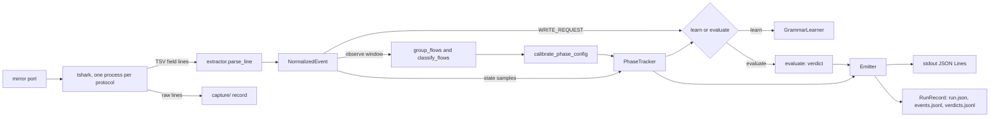

# Architecture

Two packages and one rule: everything protocol-specific lives in an extractor; everything
process-specific is discovered from traffic or declared in configuration; the engine core knows
neither.

## Protocol-neutral core: `otlab_core/engine`

| Module | Responsibility |
|---|---|
| `phase_tracker.py` | `PhaseTracker`: least-squares slope over a sliding window with hysteresis; phases UNKNOWN, RISING, FALLING, STABLE with a confidence and a transitioning flag. Consumes floats only. |
| `autocalibrate.py` | Derives the `PhaseConfig` (window, slope thresholds, hysteresis counts, confidence scale) from the observed state series: half-cycle period, rate, window-scale noise floor. |
| `discover.py` | Behavioural classifier over flows: STATE, COMMAND, CONSTANT_METADATA, AMBIGUOUS. The STATE flow with the most distinct values is the state signal, unless configuration pins one. |
| `grammar.py` | `GrammarLearner`: counts writes per target per phase under confident, non-transitioning phases; exports fractions and the learned coherent phases. |
| `evaluator.py` | `evaluate()`: COHERENT (fraction at or above 0.30), UNUSUAL (below, or target never seen), INCOHERENT (fraction 0), UNCERTAIN (phase unsettled or confidence below 0.6). |
| `config.py` | `PhaseConfig`, `OpcUaConfig`, `ModbusConfig`. |
| `wire.py` | `frame.protocols` chain parsing and the low-port server heuristic shared by probe and observer. |

## Protocol extractors: `otlab_core/extractors`

`ProtocolExtractor` (`base.py`) declares the tshark fields, the capture filter, `parse_line`,
`security_mode`, `extract_state_samples(evt, state_key)` and optional `opaque_endpoint`. Extractors
also provide `group_flows`, `variable_key`, `write_datatype` and, for Modbus, `coalesce_writes`.
`extractors/__init__.py` is the only registration point (`EXTRACTOR_CLASSES`).

- `opcua.py`: OPC UA binary. Subscription publishes are split per ClientHandle (`opcua:sub:<n>`),
  writes per node (`opcua:write:ns=<n>;i=<id>`), values read by the declared Variant type.
- `modbus.py`: polled reads per holding register (`modbus:hr:<n>`), write coalescing.
- `s7.py`: S7comm Job and Ack_Data pairing keyed by conversation and pduref (`s7:db<n>:<byte>`).

## Observer: `liscere/observe.py`

The pipeline driver. `probe_layers` finds the protocols on the wire; one tshark per claimed layer
is multiplexed in a single selector loop (`multiplex`) with a respawn supervisor; `_Run` turns the
observe, learn and evaluate windows into deadlines on a clock (`liscere/clock.py`: wall time live,
frame time in replay); `_feed_or_judge` advances the tracker or learns and judges a write;
`HoldResampler` reconstructs a report-by-exception state signal during holds so STABLE can close;
`Emitter` writes JSON Lines and the `RunRecord` sink keeps them on disk; `CycleTracker` and
`Stabilisation` (`liscere/learning.py`) measure the model as it is built. Silos (one per server
endpoint) each own a tracker, a grammar and a resampler.

## What is not here

A declared-policy layer (see [Decisions](decisions.md)), any web UI, and anything in the control
path.
